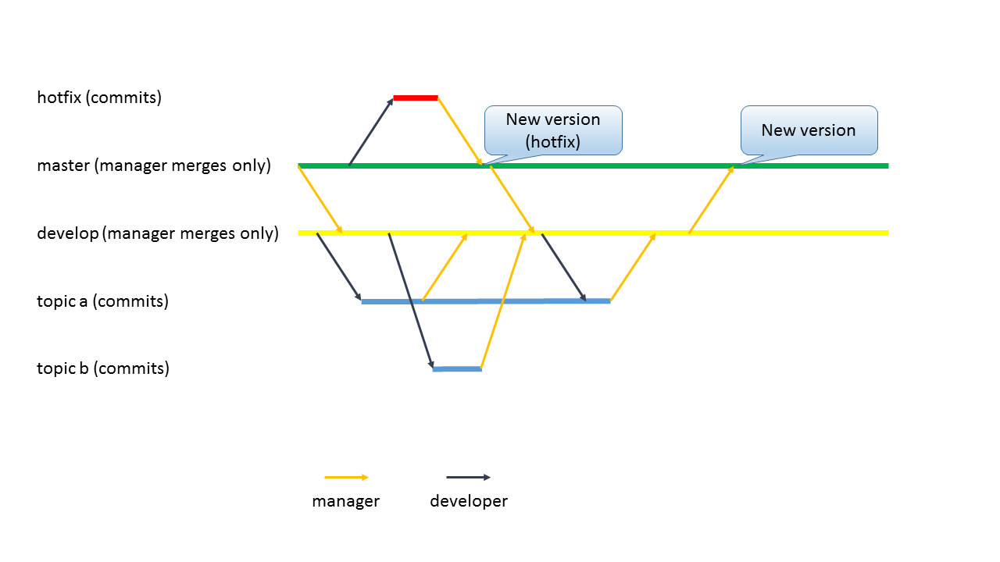
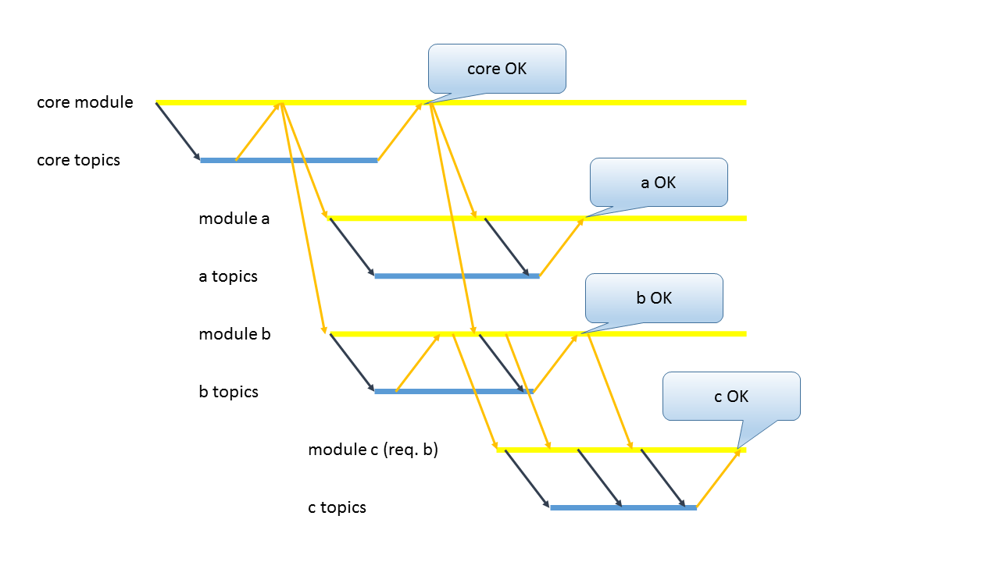

# Git 应用分享

* Author: 金正 <jinzheng@miaozhen.com>

# 分享内容

* 什么是 Git ？

* 初始化配置

* 本地变更

* 分支管理

* 远程操作

* 项目管理

# 什么是 Git ？

```
Git is a free and open source distributed version control system designed to handle everything from small to very large projects with speed and efficiency.
```

* 分布式版本控制系统 (Distributed Version Control System, DVCS)

每个工作环境下都有*全部*版本信息。当服务器出现问题时，可以通过任何一个工作环境来恢复服务器上的内容。


# 初始化配置

* 作者身份

Git 要求每一次变更都要注明作者的身份~~以便分锅~~：

```
git config --global user.name {Your Name}
git config --global user.email {your@email.com}
```

* 其他（可选）

```
git config --global push.default matching
git config --global filemode true
```

* 查看配置

```
git config --list
```

# 本地变更

* 新建 Repository

```
mkdir {my-project} && cd {my-project}
git init
```

这时会发现 `{my-project}` 目录下出现了隐藏目录 `.git` 。这个目录就是 Git 用来存储 Repository 信息的目录。

* 文件的跟踪 (Track) 与 Stage (Cache)


```
git add {FILE}
git add -A
```

只有 `add` 过的文件会被 Git 跟踪。

* 查看变更

```
git status
git diff
git diff --cached
```

* 提交变更

```
git commit -m {Commit Message}
```

只有 stage 里的内容会被提交。

* 查看版本信息

```
git log
git log -p
```

* HEAD 的概念

`HEAD` 指当前工作环境下，上一次提交的变更。或者说，所有本地的变更，都是以 `HEAD` 作为参照的。

再上一次的变更为 `HEAD^` 。

* 取消变更

```
git reset (--mixed)
git reset --hard | --soft
git reset HEAD^
```

单个文件：

```
git checkout HEAD {FILE}
```

* 文件操作

```
git mv {FILE} {NEW_PATH}
git rm {FILE}
```

* Ignore

通过配置 `.gitignore` 文件，可以让 Git 在执行

```
git add -A
git status
```

时忽略某些文件。但是，使用

```
git add {FILE}
```

仍可以强行跟踪这些文件（不推荐）。

如果一个应当被忽略的文件已经被跟踪，可以使用

```
git rm --cached {FILE}
```

来取消跟踪 (untrack)。

每个目录下都可以有一个 `.gitignore` 文件。

* 其他

通过配置 `.gitattribute` 文件，可以指定 Git 处理某些文件的策略，例如：

```
*.txt binary
```

可以让 Git 将所有 `.txt` 文件作为二进制文件处理，不对换行符进行操作。


# 分支管理

* 分支的概念


使用 `git init` 建立的 Repository ，默认分支为 `master` 。

每个分支实际上是指向一次变更的。

* 新建分支

```
git branch {NAME}
```

将以 `HEAD` 为基础新建一个分支。

* 分支列表

```
git branch
```

其中，标 `*` 的为当前所在分支。

* 切换分支

```
git checkout {NAME}
```

* 合并分支

```
git merge {NAME}
git merge --no-ff {NAME}
```

将会把 `{NAME}` 分支的变更合并进入当前分支。如果 Git 不能自动解决冲突，则需要手动解决冲突。

一些操作规范：

任何变更（包括新增、修改、删除），都应当只提交一次。

如果多个分支都需要同一个变更（如，当新版正在开发过程中，线上版本需要修复 bug），应当在这几个分支共同的、最近的一次变更的基础上进行修改，提交之后再合并到各个分支上。

# 远程操作

* 远程 (Remote)

```
git remote add {NAME} {URL}
git clone {URL} [{DIR}]
```

克隆下来的 Repository ，远程的默认名称为 `origin` 。

当远程的 URL 发生变化时（如服务器IP变化），可以通过

```
git remote set-url {NAME} {URL}
```

进行变更。

* 远程分支列表

```
git branch -a
```

* 获取远程内容

值得一提的是， Git 不会实时更新远程的内容，所以某一远程分支所指向的变更不一定是服务器上该分支所指向的变更。通过

```
git fetch
```

可以更新远程的状态。

```
git pull {REMOTE} {BRANCH}
```

可以拉取远程的变更。它相当于

```
git fetch
git merge {REMOTE}/{BRANCH}
```

* 推送到远程

```
git push {REMOTE} {BRANCH}
```

如果本地分支的内容不能通过快进模式推送到远程分支，则推送失败。

如果需要强行覆盖远程分支的内容，可以用

```
git push --force {REMOTE} {BRANCH}
```

应当谨慎使用。注意，一些 Git 服务器会保护某些分支不能被覆盖。

* 上游 (Upstream)

远程是一个 Repository 级别的概念，而对于每一个分支来说，都可以有一个上游。

```
git branch --set-upstream-to={REF}
```

将会把分支的上游设为指定的分支。此时，

```
git pull
git push
```

将会直接拉取/推送分支的远程。

在推送时，也可以直接通过

```
git push -u {REMOTE} {BRANCH}
```

指定上游分支。

查看上游：

```
git branch -vv
```

# 项目管理

* Subversion-Style Workflow

适用于个人或小型项目。


* Integration Manager Workflow


* Dictator and Lieutenants Workflow

适用于大型项目。


* 利用分支权限实现工作流

* 多人合作项目的工作流



* 多个模块同时开发的工作流



# 划重点

* 什么是 Git ？

    * 概念：DVCS

* 初始化配置

    * 命令：`config`

* 本地变更

    * 概念：Repository, Diff, Stage (Cache), Track, HEAD, Ignore

    * 命令：`init`, `status`, `diff`, `add`, `commit`, `log`, `reset`, `mv`, `rm`

* 分支管理

    * 概念：Branch

    * 命令：`branch`, `checkout`, `merge`

* 远程操作

    * 概念：Remote, Upstream

    * 命令：`remote`, `clone`, `fetch`, `pull`, `push`

* 项目管理

    * 不同分支的作用
